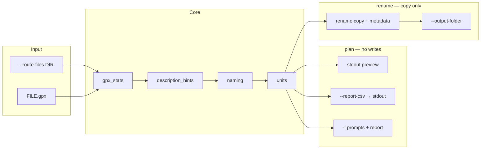

# GPX Standardiser — design overview

Club CLI that reads local GPX files, computes distance and ascent from track geometry, and **copies** renamed outputs using a canonical basename (`ADR-0002`). Source files are never modified in place (`ADR-0005`).

Detailed decisions live in [Architecture Decision Records](adr/).

## Data flow

**`plan`** analyses and prints; **`rename`** performs the same maths and hints, then copies to the destination folder with an updated GPX `<name>` (`ADR-0004`).

## Modules

| Module | Role |
|--------|------|
| `cli.py` | Typer routing and I/O only |
| `gpx_stats.py` | Haversine distance, smoothed ascent (`ADR-0003`) |
| `description_hints.py` | Basename → suggested description slug (`ADR-0004`) |
| `naming.py` | Canonical `{dist}{unit}-{ascent}{unit}@{desc}.gpx` stem (`ADR-0002`) |
| `units.py` | Imperial (default) / metric display and filename rounding |
| `plan_report.py` | CSV rows for `plan --report-csv` |
| `ride_difficulty.py` | m/km, grade %, tier labels, batch rank |
| `rename.py` | Copy renamed GPX; duplicate stem numbering |
| `config/` | YAML discovery and join/filter rules (`ADR-0007`) |

## Backlog

| # | Item | Status | Notes |
|---|------|--------|-------|
| 1 | **Plan CSV report** (`plan --report-csv`) | **Complete** | `plan_report.py`, `ride_difficulty.py`, extended `TrackMetrics`; ADR-0005 + README (2026-05-26). Tests: `test_plan_report`, `test_ride_difficulty`, `test_cli_plan_csv`. |
| 2 | Segment FIETS / per-climb scoring | Deferred | Whole-route FIETS rejected; needs climb segmentation |
| 3 | CSV on `rename` or interactive `plan -i` | Deferred | Stdout CSV only on non-interactive `plan` for v1 |
| 4 | Configurable difficulty tiers in YAML | Deferred | Fixed UK bands in `ride_difficulty.py` |
| 5 | Upload-order manifest | Rejected | Manual Finder ordering per ADR-0005 |
